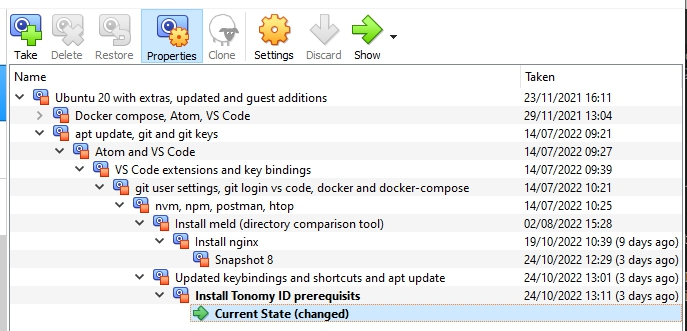

# Tonomy-ID Contributor's Guide

A big welcome and thank you for considering contributing to Tonomy! It is people like you that help shape the future where your identity is in your hands.

Reading and following these guidelines will help us make the contribution process easy and effective for everyone involved. It also communicates that you respect the time of the developers managing and developing these open source projects. In return, we will reciprocate this by adressing your issue, assessing changes and helping you finalize your pull requests.

## Quicklinks

* [Git and development policy](#git-and-development-policy)
* [Environment](#environment)
* [Setup Virtualbox](#setup-virtualbox)
* [Tonomy ID Workshop](#tonomy-id-workshop)
* [Design](#design)
* [General Practices](#general-practices)
* [Issues](#issues)
* [Pull Requests](#pull-requests)
* [Getting Help](#getting-help)

## Git and development policy

Git branch policy:


Development process:


Source: <https://drive.google.com/file/d/1-mACdt8ucz5ONKpqiECjSz3GAP0ASq8o/view?usp=sharing>

## Setup Virtualbox

We use the Ubuntu 20.04 / 22.04 environments. Please use them, as Windows is not suggested & Mac is untested.
If you have a Windows or Mac PC, it's suggested to install VirtualBox.

It is possible to run on Mac. Please adapt and install the [dependencies](./README.md#dependancies) with `brew` instead. Antelope has [known issues with the M1 chip](https://github.com/EOSIO/eos/issues/9759).

### Setup Virtualbox with ready image

This is suggested for anyone new to Virtualbox or the project.

Steps to have a fully configured Ubuntu 20.04 LTS machine with all Tonomy-ID-Integration [dependencies installed at commit 0957658](https://github.com/Tonomy-Foundation/Tonomy-ID-Integration/blob/0957658bc16fa71632dad0acb67b6935f065f199/README.md#dependancies), and Tonomy-ID-Integration installed and ready to run.

Steps:

1. Download the Virtualbox image here:
2. Import this as a new machine in VirtualBox
3. Change the network driver to bridge mode
4. Run the VM. Login details:

```bash
username=dev
password=Password123!
```

5. Run `ip a` and note the IP address of the VM. See [here](https://linuxhint.com/use-virtualbox-bridged-adapter) for more details.
6. Change the `localhost` values in `./Tonomy ID/src/config/config.json` to the IP address
7. Follow the [pre-run](./README.md#pre-run-one-time) setup, including login to `eas`
8. Now run `./app.sh start` and open the app from your phone. See [run](./README.md#run) for how this works.

Additionally, you may want to re-install Guest additions on the new VM. You may want to install your own `ssh` keys for Github. You may want to turn Auto Capture Keyboard in settings to have [Ctr/Alt] keystrokes inputted into the VM properly.

### Setup Virtualbox manually

This gives you more control over the virtual machine.

Setup Virtualbox to connect to the React Native app:

* Download and install the latest [VirtualBox hypervisor](https://www.virtualbox.org/)
* Download the latest [Ubuntu LTS desktop image (.iso)](https://releases.ubuntu.com/) and install in a new Virtual Machine

You need to change the network mode of the Virtualbox VM that is running Tonomy ID to use a Bridged connection:
<https://linuxhint.com/use-virtualbox-bridged-adapter/>

Once this is set up, you should be able to run `./app.sh start` and then connect with the QR code.

To connect to the service manually, or other services in the Virtualbox, find your IP address using `ip a` inside the Virtualbox as shown in the article above. Then you can use this IP address in your host to access exposed services. For example you can go to your browser and open <http://10.2.218.179:3000> to get to the demo app.

You need to update `localhost` value(s) in `./Tonomy-ID/src/config/config.json` to use this IP address, so that the mobile app can connect to the blockchain and other services running on your computer.

We strongly suggest you create regular snapshots in Virtualbox, including after you have installed Ubuntu. This allows you to go back to the last point when you had the software working. Remember to turn the machine off before creating a snapshot.



## Resources

### Tonomy ID Workshop

Watch to understand the architecture and general model and use case:

<https://www.loom.com/share/d29cda0913bf4f569ed501aee76c5337>

### Design

Figma design:

<https://www.figma.com/file/cvV48t0f7O2znT6QBxK0Zj/Tonomy-ID>

### General practices

* The JavaScript variables capital convention is [CamelCase](https://textcaseconvert.com/blog/what-is-camel-case/)

## Contributing

### Looking for how to contribute?

Check out the issues in the [repositories](./README.md#repositories), or, if you have access, the issues in our [Zenhub board](https://app.zenhub.com/workspaces/tonomy-id-62a06b705d27820023023630/board)

### Issues

Issues should be used to report problems with the library, request a new feature, or to discuss potential changes before a PR is created.

If you find an issue that adresses the problems you're having, please add your own reproduction information to the existing issue rather than creating a new one. Adding a [reaction](link) can also help with indicating to our maintainers and developers.

### Pull Requests

PRs are the best and quickest way to get your fix, improvement or feature merged. In general, PRs should:

* Only fix/add the functionality in the issue
* Address a single concern in the least number of changed lines as possible

### Getting Help

Send a message to contact@tonomy.foundation for help or reach out on our [Discord](https://discord.gg/rrJwz6Uf5P)
